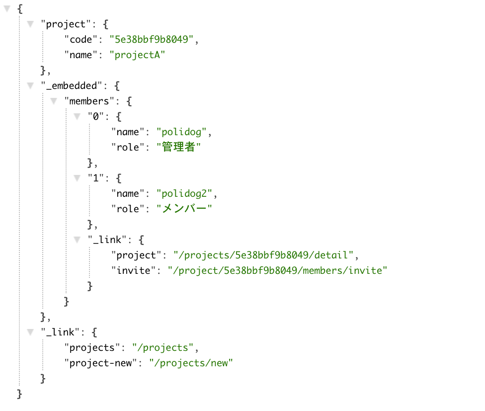

# Polidog/HypermediaBundle

HypermediaAPI bundle.
This bundle support only HAL json. And you mast need [polidog/simple-api-bundle](https://packagist.org/packages/polidog/simple-api-bundle)

## Installation

```shell script
$ composer require polidog/hypermedia-bundle "dev-master" 
```

```php
<?php

return [
...


    Polidog\SimpleApiBundle\PolidogSimpleApiBundle::class => ['all' => true],
    Polidog\HypermediaBundle\HypermediaBundle::class => ['all' => true]
];

```

### Introduce bundle configuration to your config file

```yaml
# config/packages/polidog_hypermedia.yml

polidog_hypermedia: ~
    hal_content_type: false # default false
```

If `hal_content_type` is true that need request header for `application/hal+json`.


## Usage

```php
<?php

declare(strict_types=1);

namespace App\Controller\Api\Projects;

use App\Repository\ProjectRepository;
use Polidog\HypermediaBundle\Annotations\Embed;
use Polidog\HypermediaBundle\Annotations\Link;
use Polidog\SimpleApiBundle\Annotations\Api;
use Symfony\Component\Routing\Annotation\Route;

/**
 * @Route("/projects/{code}/detail", requirements={"code"})
 * @Api(statusCode=200)
 *
 * @Embed(rel="members", src="/api/projects/{code}/members")
 *
 * @Link(rel="projects", href="/projects")
 * @Link(rel="project-new", href="/projects/new")
 *
 */
class DetailController
{
    /**
     * @var ProjectRepository
     */
    private $repository;

    public function __construct(ProjectRepository $repository)
    {
        $this->repository = $repository;
    }

    /**
     * @return array<string,array|null>
     */
    public function __invoke(string $code): array
    {
        $project = $this->repository->findProjectCode($code);

        return [
            'project' => null !== $project ? $project->export() : null,
        ];
    }
}
```




